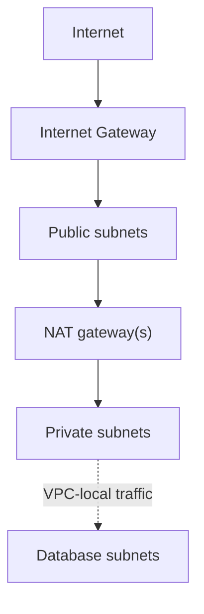

# Stratovio Technologies AWS VPC Module

A production-oriented Terraform module that creates an IPv4 AWS VPC with public, private, and isolated database subnet tiers across two to six Availability Zones.

## Architecture



- Public subnets use a shared route table with an IPv4 default route to the internet gateway.
- Private subnets use one route table per Availability Zone. Their optional default route uses the configured NAT strategy.
- Database subnets use one route table per Availability Zone with no internet default route.
- Every subnet is explicitly associated with its intended route table, leaving the VPC main route table unchanged.

Security groups and network ACL rules for application workloads are intentionally outside this module.

## Features

- Stable, Availability Zone-keyed subnet configuration
- One public, private, and database subnet per configured Availability Zone
- `per_az` NAT mode for zonal resilience
- `single` NAT mode for lower non-production cost
- `none` NAT mode for fully isolated private subnets
- Optional RDS DB subnet group
- Optional VPC Flow Logs delivered to CloudWatch Logs
- Configurable log retention and KMS encryption
- Default security group changed to deny all ingress and egress by default
- Consistent tags and subnet-tier tags
- Native `terraform test` coverage with a mocked AWS provider

## Usage

```hcl
module "vpc" {
  source = "./modules/vpc"

  name     = "stratovio-prod"
  vpc_cidr = "10.20.0.0/16"

  subnets = {
    us-east-2a = {
      public_cidr   = "10.20.0.0/24"
      private_cidr  = "10.20.10.0/24"
      database_cidr = "10.20.20.0/24"
    }
    us-east-2b = {
      public_cidr   = "10.20.1.0/24"
      private_cidr  = "10.20.11.0/24"
      database_cidr = "10.20.21.0/24"
    }
    us-east-2c = {
      public_cidr   = "10.20.2.0/24"
      private_cidr  = "10.20.12.0/24"
      database_cidr = "10.20.22.0/24"
    }
  }

  nat_gateway_mode             = "per_az"
  enable_flow_logs             = true
  manage_default_security_group = true

  tags = {
    Company     = "Stratovio Technologies"
    Environment = "production"
    CostCenter  = "shared-networking"
  }
}
```

See [`examples/complete`](./examples/complete) for a deployable example.

## NAT gateway modes

| Mode | NAT gateways | Private internet egress | Intended use |
| --- | ---: | --- | --- |
| `per_az` | One per AZ | Yes, through the same AZ | Production and high availability |
| `single` | One in the first sorted AZ | Yes, including cross-AZ routes | Development or cost-sensitive environments |
| `none` | Zero | No | Fully isolated workloads or private connectivity only |

`per_az` is the default. A single NAT gateway costs less but creates a zonal dependency and can add cross-AZ data-processing charges. Database subnets never receive a route through a NAT gateway.

## Requirements

| Component | Version |
| --- | --- |
| Terraform | `>= 1.7.0, < 2.0.0` |
| AWS provider | `>= 6.0, < 7.0, != 6.57.0` |

AWS provider `6.57.0` is excluded because HashiCorp marked that release as having a significant bug.

## Inputs

| Name | Type | Default | Description |
| --- | --- | --- | --- |
| `name` | `string` | Required | Lowercase resource-name prefix, 2-32 characters. |
| `vpc_cidr` | `string` | Required | IPv4 CIDR block for the VPC. |
| `subnets` | `map(object)` | Required | Public, private, and database CIDRs keyed by Availability Zone. |
| `nat_gateway_mode` | `string` | `"per_az"` | `none`, `single`, or `per_az`. |
| `map_public_ip_on_launch` | `bool` | `false` | Automatically assign public IPv4 addresses in public subnets. |
| `enable_dns_support` | `bool` | `true` | Enable VPC DNS resolution. |
| `enable_dns_hostnames` | `bool` | `true` | Enable public DNS hostnames. |
| `enable_network_address_usage_metrics` | `bool` | `false` | Enable Network Address Usage metrics. |
| `manage_default_security_group` | `bool` | `true` | Remove all rules from the default security group. |
| `create_database_subnet_group` | `bool` | `true` | Create an RDS DB subnet group. |
| `database_subnet_group_name` | `string` | `null` | Optional RDS DB subnet group name. |
| `enable_flow_logs` | `bool` | `false` | Publish VPC Flow Logs to CloudWatch Logs. |
| `flow_log_traffic_type` | `string` | `"ALL"` | Capture `ACCEPT`, `REJECT`, or `ALL` traffic. |
| `flow_log_retention_in_days` | `number` | `90` | CloudWatch Logs retention. |
| `flow_log_kms_key_id` | `string` | `null` | Optional KMS key ARN for log encryption. |
| `flow_log_max_aggregation_interval` | `number` | `60` | Flow-log aggregation interval: 60 or 600 seconds. |
| `tags` | `map(string)` | `{}` | Tags applied to all resources. |
| `vpc_tags` | `map(string)` | `{}` | Additional VPC tags. |
| `public_subnet_tags` | `map(string)` | `{}` | Additional public subnet tags. |
| `private_subnet_tags` | `map(string)` | `{}` | Additional private subnet tags. |
| `database_subnet_tags` | `map(string)` | `{}` | Additional database subnet tags. |

All subnet CIDRs must be unique, non-overlapping, and contained within `vpc_cidr`. Terraform validates their IPv4 syntax and uniqueness; AWS validates containment and overlap during planning or apply.

## Outputs

The module returns the VPC and internet gateway IDs, ordered subnet ID lists, subnet IDs keyed by Availability Zone, route-table IDs, NAT gateway IDs and public IPs, the database subnet group name, and optional flow-log resources. See [`outputs.tf`](./outputs.tf) for the complete contract.

## Validation

```shell
terraform fmt -check -recursive
terraform init -backend=false
terraform validate
terraform test
tflint --recursive
```

The tests use Terraform's mocked-provider support and do not create AWS resources or require AWS credentials.

## Operational notes

- Review NAT gateway and CloudWatch Logs pricing before deployment.
- Use `per_az` for production workloads that require resilient internet egress.
- Set `map_public_ip_on_launch = true` only when instances should receive public IPv4 addresses automatically.
- Attach workload-specific security groups; the managed default security group intentionally permits no traffic.
- When `flow_log_kms_key_id` is set, ensure the KMS key policy permits the regional CloudWatch Logs service principal to use the key.
- Add VPC endpoints at the environment layer when workloads need private access to AWS services. This keeps endpoint policies and service choices out of the shared network primitive.
